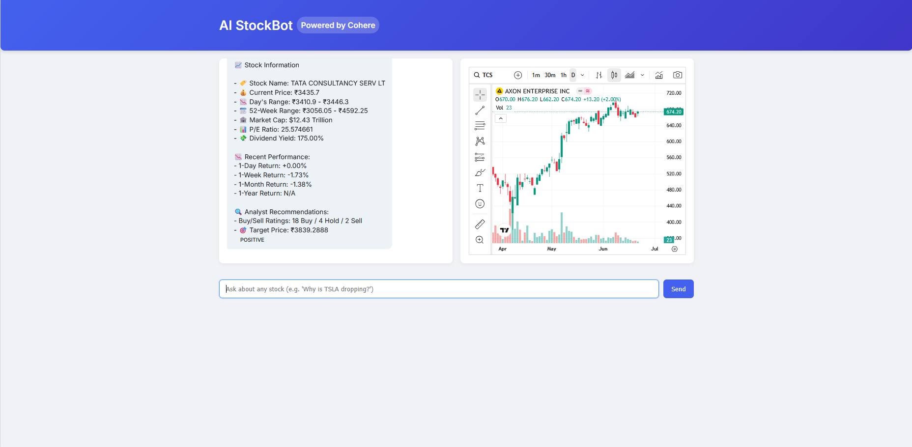

# 🤖 AI StockBot – Smart Stock Market Assistant (Powered by Cohere & FastAPI)

AI StockBot is an intelligent conversational assistant that delivers **real-time stock insights**, **market trends**, **fundamental metrics**, and **investment advice**—all through natural language queries. It supports both **Indian** and **global markets**, leveraging advanced NLP capabilities from **Cohere** and financial data via **Yahoo Finance & NSE**.

---

## 📸 Preview



---

## 🚀 Features

- 🔎 **Ask Anything**: "Should I buy TCS?", "What's the target price for Apple?", "How do I start investing?"
- 📊 **Detailed Stock Insights**: Live data including price, volume, P/E ratio, market cap, dividend yield, and more.
- 🧠 **Investment Advice**: Generates contextual, AI-powered recommendations for buy/sell decisions.
- 📈 **Real-Time Charting**: Integrated TradingView charts based on user queries.
- 🗣️ **Voice Mode (optional)**: Converts speech to text for interactive voice conversations.
- 🌏 **Multi-Market Support**: Handles both Indian stocks (NSE/BSE) and global stocks (NASDAQ/NYSE).
- 📚 **Educational Answers**: Understand technical/fundamental analysis, market trends, diversification, etc.
- 💬 **Conversational UI**: Clean, responsive front-end for chat + charts interface.

---

## 🧪 Example Queries

- 💬 Should I buy Apple stock?
- 📈 Show me the P/E ratio and market cap of TCS
- 🤔 What are the risks of investing in the stock market?
- 📉 Why is Reliance stock down today?
- 📊 How do I diversify my portfolio as a beginner?


---

## ⚙️ Tech Stack

| Layer        | Tools Used                      |
|--------------|----------------------------------|
| Backend      | Python, FastAPI, Uvicorn         |
| NLP / AI     | [Cohere](https://cohere.com) LLM |
| Data Sources | yFinance (Yahoo), AlphaVantage (fallback), NSE |
| Frontend     | HTML, CSS (Custom), JS           |
| Charts       | [TradingView Widget](https://www.tradingview.com/widget/) |
| Caching      | Redis                            |
| Deployment   | Uvicorn / Optional Docker setup  |

---

## 📂 Project Structure

ai-stockbot/

├── app/

│ ├── init.py

│ ├── analyzer.py # Handles voice input, extraction logic

│ ├── config.py # API keys, Redis, env

│ ├── models.py # Pydantic models

│ ├── routes.py # FastAPI routes

│ ├── utils.py # Stock fetchers, formatters, helpers

│ ├── intent_router.py # Custom intent classification & fallback

├── static/

│ └── index.html # Frontend UI

├── main.py # FastAPI app entrypoint

├── requirements.txt

├── README.md

├── .env.example

└── .gitignore

---

## 🧰 Setup Instructions

### 🔧 Local Setup

```bash
git clone https://github.com/yourusername/ai-stockbot.git
cd ai-stockbot

# Create and activate virtual environment
python -m venv venv
source venv/bin/activate  # or venv\Scripts\activate on Windows

# Install dependencies
pip install -r requirements.txt

# Add your Cohere and Alpha Vantage keys to `.env`
cp .env.example .env

## Run the App

uvicorn main:app --reload

Then open static/index.html in your browser

## Powered By
- 🧠 Cohere – Natural language generation & classification

- 📈 TradingView – Stock charting widgets

- 📊 Yahoo Finance (via yfinance) – Real-time market data

- 📚 FastAPI – High-performance Python API

## Disclaimer

AI StockBot provides general financial information and does not constitute investment advice. Always consult with a financial advisor before making investment decisions.


## Acknowledgements

Special thanks to:

- Cohere for enabling powerful language understanding.

- Yahoo Finance & TradingView for reliable stock market data.


### ✅ Tip:

You can also add a `docs/interface-preview.png` screenshot (like the one you shared) and update the `README.md` to show the image.

Would you like me to also generate a `.env.example` or Dockerfile for deployment on Render or similar platforms?

